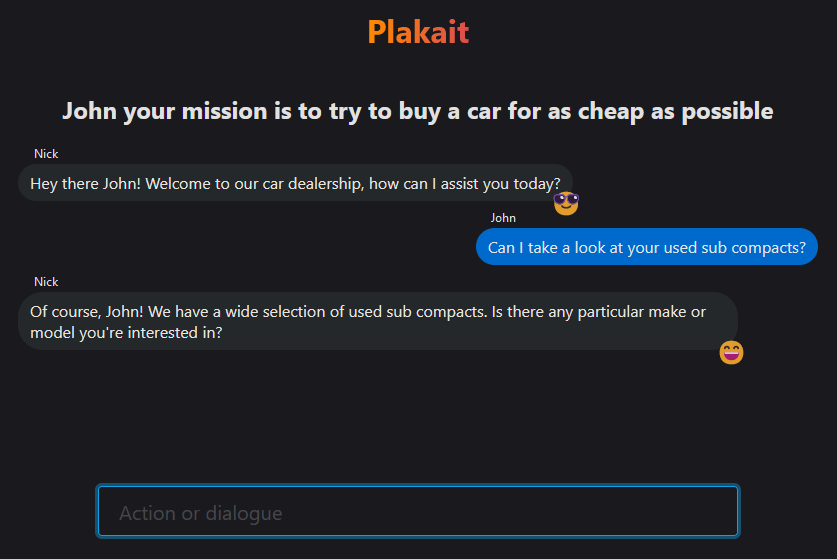

# Plakait

A dialogue game.

Using Vite, ChatGPT and Lit Web Components.

[Backend Repo](https://github.com/stevenhuyn/plakait-backend)

## ~~Further things to do?~~ Kinda done

- [x] Rewind time and retry message upon JSON.parse error (Done on backend)
- [x] Add other scenarios (more than 2 person scenario which mid game bosses)
- [ ] Add more cool ending screen
- [ ] ~~Allow input of API key in an input~~ Nah don't care
- [x] Better disabling of elements upon different game states
- [ ] Cleanup of da code to be more coherent (ongoing)
